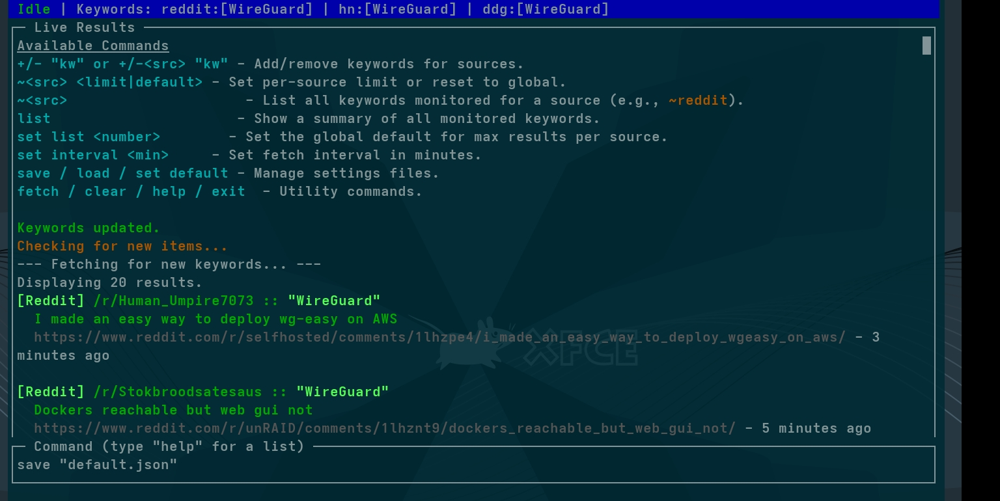

# TUI Socials Monitor

A powerful, self-hosted, terminal-based keyword monitor for Reddit, Hacker News, and general web content via DuckDuckGo.

This application provides an interactive Terminal User Interface (TUI) to dynamically add, remove, and manage keywords, with all settings persisted across sessions. It features robust keyword highlighting and a fully reworked display for maximum clarity.

# Screenshot



## Features

- **Interactive TUI:** A clean, scrollable interface built with `blessed` that runs directly in your terminal.
- **Multi-Source Monitoring:** Fetches new posts from Reddit, Hacker News, and DuckDuckGo.
- **Advanced Keyword Management:** Add or remove keywords globally or for specific sources on the fly.
- **Robust Highlighting:** Intelligently finds and bolds matched keywords within result snippets.
- **Customized Display:** Each source (Reddit, HN, DDG) has a unique, clear display format.
- **Persistent & Portable Settings:**
    - Automatically saves your configuration to `settings.json` on every change.
    - Loads your default settings and performs an initial search on startup.
    - Save, load, and manage multiple named configurations (e.g., `work.json`, `hobby.json`).
- **Customizable Fetching:**
    - Set a global limit for how many results are shown per source.
    - Override the global limit for specific sources.
    - Set the automatic refresh interval.
- **On-Demand Information:** Instantly list all configured keywords for a quick overview of your settings.

## Installation

1.  **Prerequisites:** You must have [Node.js](https://nodejs.org/) (v16 or newer) installed on your system.

2.  **Setup Project:**
    - Clone this repository or create a new directory for the project.
    - Save the application code as `socials.js` inside that directory.
    - Create a `package.json` file by running `npm init -y`.
    - **Important:** Open the new `package.json` and add the line `"type": "module",` to enable modern JavaScript syntax.

3.  **Install Dependencies:** Open your terminal in the project directory and run:
    ```bash
    npm install blessed axios cheerio rss-parser date-fns
    ```

## Usage

To run the application, navigate to your project directory in the terminal and execute:

```bash
node socials.js
```

The application will start, load `settings.json` if it exists, perform an initial search, and display a list of available commands.

## Commands

Commands are typed into the input box at the bottom of the screen. Phrases with spaces must be wrapped in quotes.

### Keyword Management

-   **Add Keyword (Global):** `+ "keyword"` or `+ "keyword one" "keyword two"`
    Adds one or more keywords to be monitored on ALL sources.

-   **Add Keyword (Specific):** `+<source> "keyword"`
    *   `Example:` `+reddit "raspberry pi 5"`
    *   `Example:` `+hn "show hn"`

-   **Remove Keyword (Global):** `- "keyword"`

-   **Remove Keyword (Specific):** `-<source> "keyword"`
    *   `Example:` `-ddg "some company"`

### Listing & Display Commands

-   **List All Keyword Settings:** `list`
    Instantly displays a summary of all keywords currently being monitored for each source. This is an offline command and does not fetch results.

### Configuration

-   **Set Global Result Limit:** `set list <number>`
    Sets the default maximum number of results to show from each source.
    *   `Example:` `set list 5`

-   **Set Per-Source Result Limit:** `~<source> <limit|default>`
    Overrides the global limit for one source, or resets it to the default.
    *   `Example:` `~reddit 15` (Show up to 15 results from Reddit)
    *   `Example:` `~hn default` (HN will now use the global limit)

-   **Set Fetch Interval:** `set interval <minutes>`
    Changes how often the app automatically checks for new results.
    *   `Example:` `set interval 10` (Refresh every 10 minutes)

### File Management

-   **Save Configuration:** `save <filename.json>`
    Saves the *current* set of keywords, limits, and interval to a new file.
    *   `Example:` `save work-keywords.json`

-   **Load Configuration:** `load <filename>`
    Loads settings from a saved file, replacing the current configuration. Partial names work.
    *   `Example:` `load work` will load `work-keywords.json`.

-   **Set Default Configuration:** `set default <filename.json>`
    Copies a saved configuration file to `settings.json`, making it the new default that loads every time the app starts.
    *   `Example:` `set default work-keywords.json`

### Utility Commands

-   **`fetch`**: Manually trigger a refresh for all monitored keywords.
-   **`clear`**: Clear all text from the results window.
-   **`help`**: Display the list of available commands.
-   **`exit`** or `Ctrl+C`: Quit the application.
